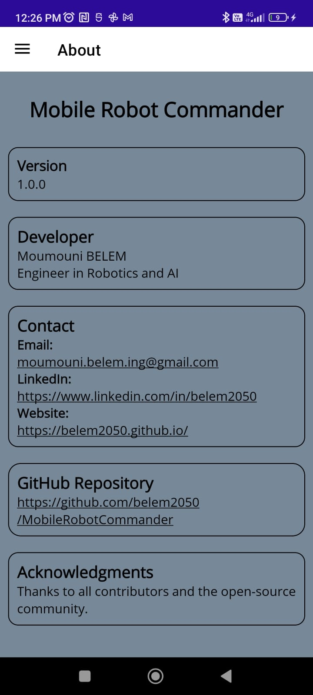

# 🤖 MobileRobotCommander

**MobileRobotCommander** is a cross-platform .NET MAUI application for configuring and controlling mobile robots using customizable network and ROS (Robot Operating System) settings. 
This app allows users to adjust robot parameters such as IP address, port, command velocity topics, and speed limits in a user-friendly interface.
Either manual joystick or vocal instructions can be used!
## 🧰 Features

- Set default robot IP address and port
- Configure ROS command velocity topic
- Adjust max linear and angular speed using sliders
- Save and reset settings easily

---

## 📱 UI Preview

<div style="display: flex; flex-wrap: wrap; gap: 10px; justify-content: center;">

  
  
  
  
  
  

</div>


---

## 🏗️ Built With

- [.NET MAUI](https://learn.microsoft.com/en-us/dotnet/maui/)
- MVVM pattern with data binding
- XAML for UI design
- C# for logic and view models

---


## 🚀 Getting Started
### To download the apk file, it is [here](https://github.com/belem2050/MobileRobotCommander/releases/download/1.0.0/belem2050.mobilerobotcommander-Signed.apk).
---
### For code savy, keep going to set dev env.
### Prerequisites

- [.NET 7 or 8 SDK](https://dotnet.microsoft.com/en-us/download)
- Visual Studio 2022+ with MAUI workload installed
- A connected Android/iOS device or simulator

- A robot running rosbridge webserver

### Running the App


```bash
git clone https://github.com/your-username/MobileRobotCommander.git
cd MobileRobotCommander
dotnet build
dotnet run
```


Then, take in the Dedug/Realease Folder the apk file and install on the mobile phone.
That's it! we're ready to go!

---
## Coming

I am on the process to get it on Play Store!
